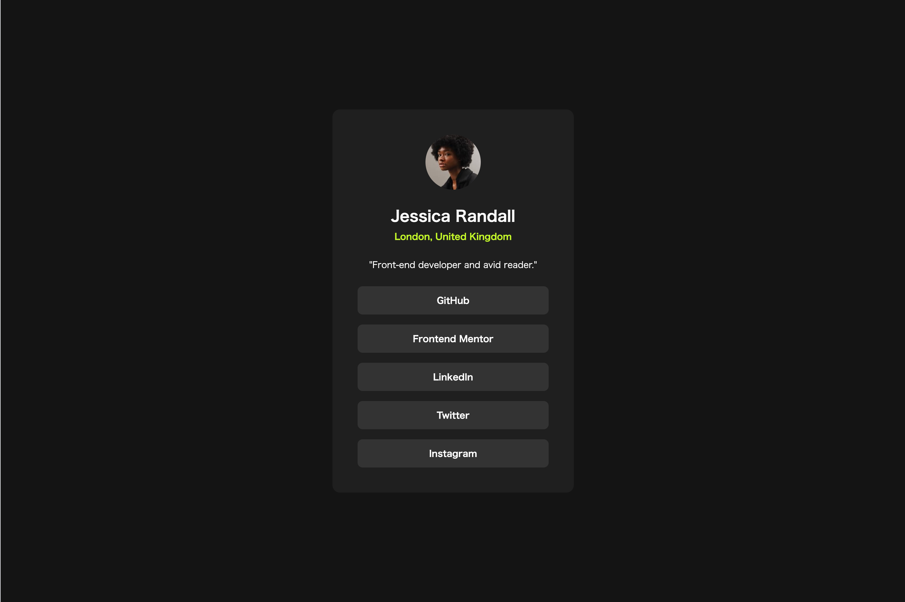
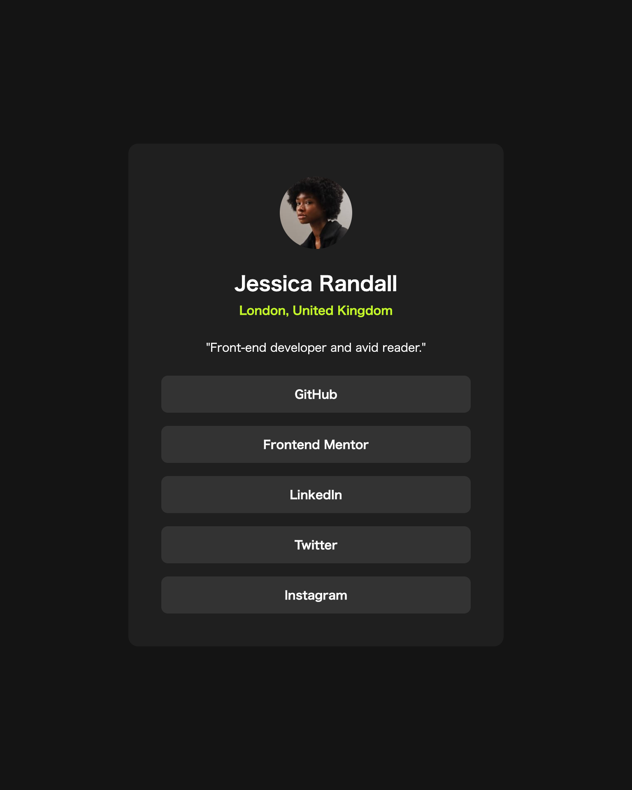
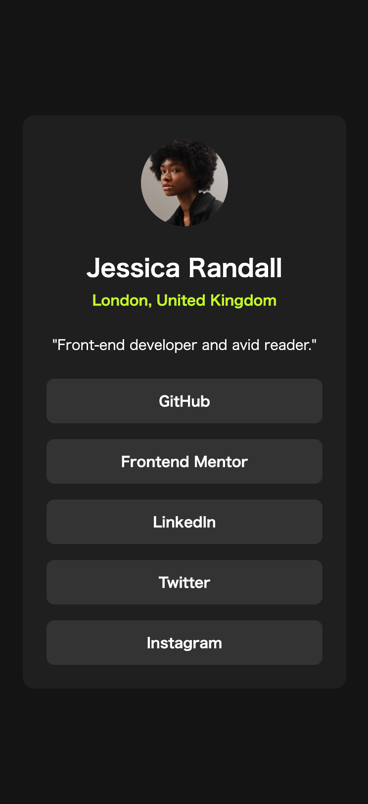

# Frontend Mentor - Social links profile solution

This is a solution to the [Social links profile challenge on Frontend Mentor](https://www.frontendmentor.io/challenges/social-links-profile-UG32l9m6dQ). Frontend Mentor challenges help you improve your coding skills by building realistic projects.

## Table of contents

- [Frontend Mentor - Social links profile solution](#frontend-mentor---social-links-profile-solution)
  - [Table of contents](#table-of-contents)
  - [Overview](#overview)
    - [The challenge](#the-challenge)
    - [Screenshot](#screenshot)
    - [Links](#links)
  - [My process](#my-process)
    - [Built with](#built-with)
    - [What I learned](#what-i-learned)
    - [Continued development](#continued-development)
    - [Useful resources](#useful-resources)
  - [Author](#author)
  - [Acknowledgments](#acknowledgments)

## Overview

### The challenge

- Users should be able to:

  - See hover and focus states for all interactive elements on the page

- Ideas to test myself
  1. Personalize the project to add your own information, links, and color palette.
  2. Focus on writing semantic HTML and using the correct elements based on the content.
  3. Ensure visitors can navigate the links only using their keyboard.
  4. Train your eye for detail by getting your solution to look similar to the design.

### Screenshot





### Links

- Solution URL: [https://github.com/okotass/okotass.github.io/tree/main/3-social-links-profile](https://github.com/okotass/okotass.github.io/tree/main/3-social-links-profile)
- Live Site URL: [https://okotass.github.io/3-social-links-profile](https://okotass.github.io/3-social-links-profile)

## My process

### Built with

- Semantic HTML5 markup
- CSS custom properties
- Flexbox

### What I learned

- Mobile first
- CSS

```css
.link-button {
  transition-duration: 0.7s;
}
```

### Continued development

- Mobile first
- CSS

### Useful resources

- [mdn_transition-property](https://developer.mozilla.org/ja/docs/Web/CSS/transition-property)
- [mdn_button](https://developer.mozilla.org/ja/docs/Web/HTML/Element/button) - I was not sure whether to use <button> for the link button, but considering its intended use, implemented it without button.

## Author

- Frontend Mentor - [okotass](https://www.frontendmentor.io/profile/okotass)

## Acknowledgments

Thanks for looking at my solution🤝
